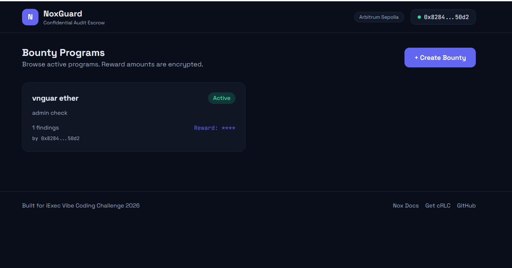
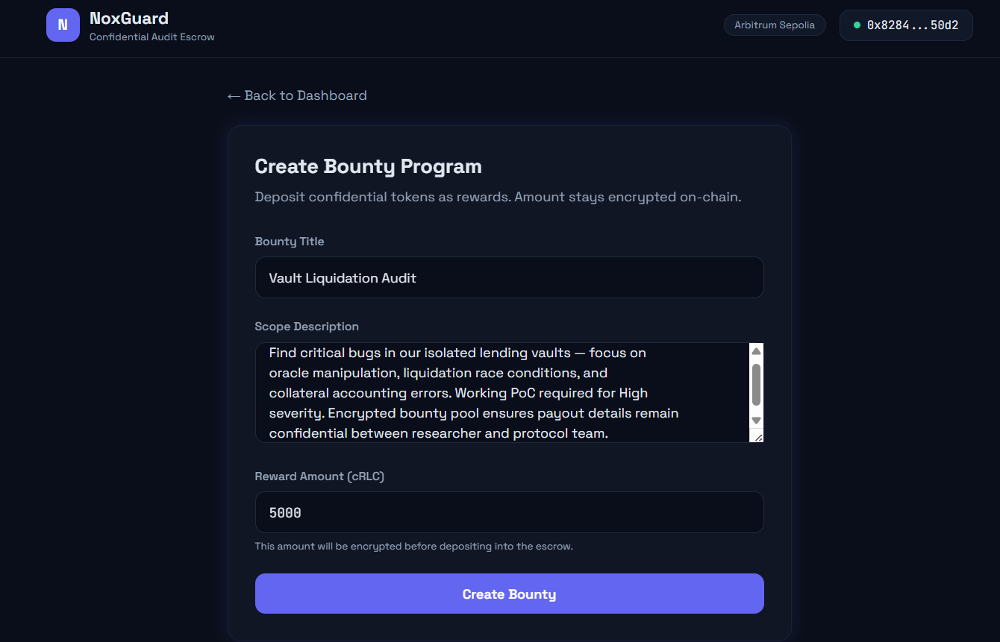
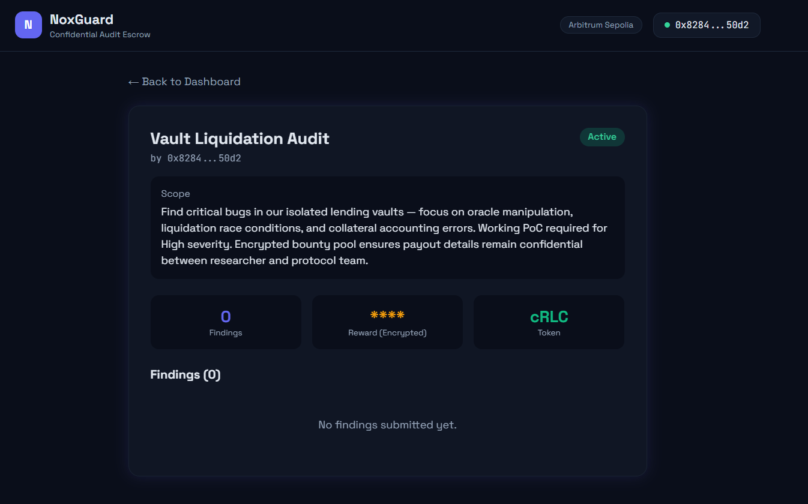
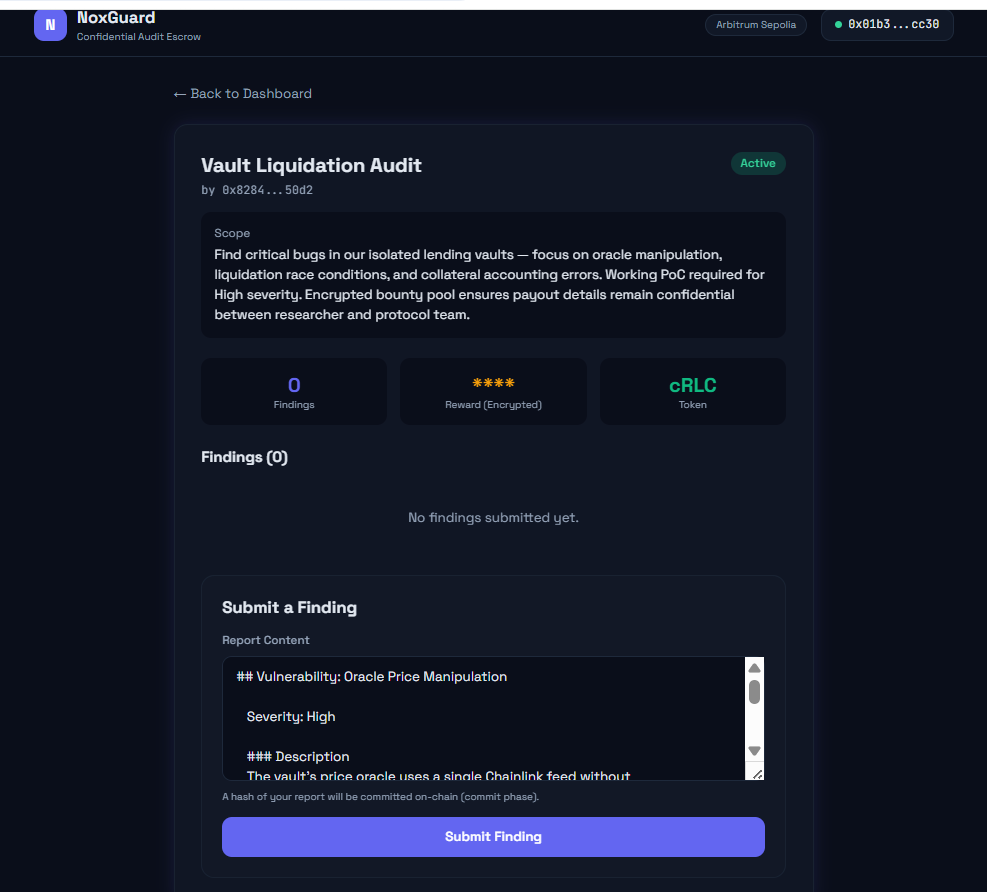
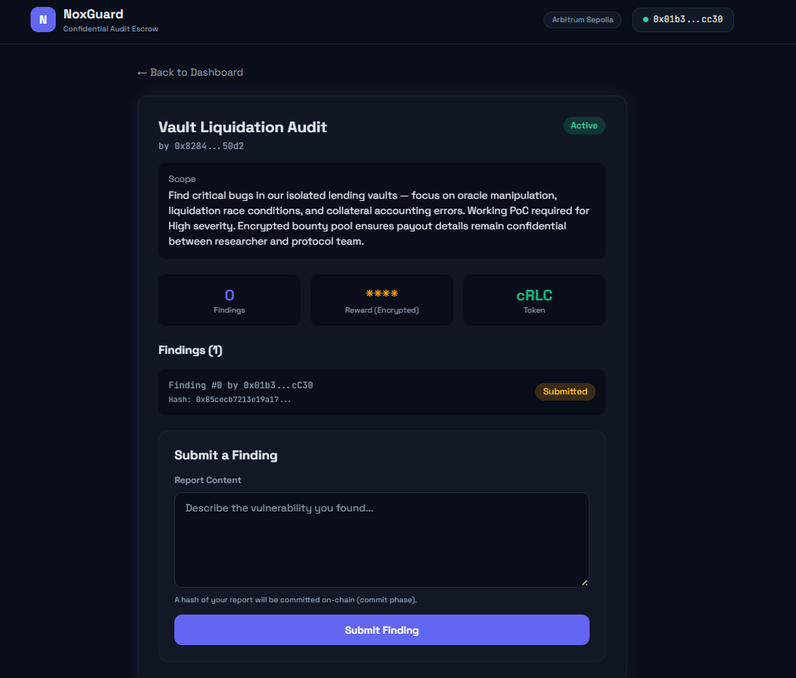

# 🛡️ NoxGuard

**Confidential Bug Bounty Escrow on Arbitrum Sepolia**

Built for the [iExec Vibe Coding Challenge 2026](https://iex.ec/) using the Nox Protocol (FHE + TEE) and ERC-7984 Confidential Tokens.

[](https://sepolia.arbiscan.io/)
[](https://docs.iex.ec/)
[](https://eips.ethereum.org/EIPS/eip-7984)
[](LICENSE)

---

## 🚀 Try It Now

> **Live demo:** [**https://noxguard-one.vercel.app**](https://noxguard-one.vercel.app)
>
> Connect MetaMask on **Arbitrum Sepolia**, grab some [cRLC from the iExec faucet](https://cdefi.iex.ec/) and a bit of [Arbitrum Sepolia ETH](https://www.alchemy.com/faucets/arbitrum-sepolia) for gas, and you can create or submit to a bounty in under a minute.



---

## 🎯 The Problem

Public bug bounty programs **leak strategic information**. When a $50,000 reward gets paid on-chain to a hunter, anyone can see it — including:
- Competing protocols guessing how severe the bug was
- Other hunters reverse-engineering payout patterns to find similar issues
- Attackers profiling which projects pay big (= which projects had big bugs)

Reward amounts are **business intelligence**. They should not be publicly broadcast.

## 💡 The Solution

NoxGuard is an **end-to-end confidential bounty escrow**. Reward amounts are encrypted at every stage of the lifecycle:

1. **Project Owner** locks an encrypted bounty amount in the escrow contract
2. **Hunter** submits a finding with the keccak256 hash of their report
3. **Project Owner** reviews the finding off-chain, then approves with an encrypted payout
4. **Settlement** happens on-chain — the hunter receives confidential tokens (cRLC), amount hidden from everyone else
5. **Hunter** can later unwrap confidential tokens to regular ERC-20 whenever they want

All reward amounts remain encrypted throughout the entire lifecycle. **Nobody except the project owner and the receiving hunter knows how much was paid.**

---

## 📸 End-to-End Walkthrough

The flow below is the full lifecycle — from creating a bounty to a hunter committing a finding hash on-chain. All five steps are reproducible right now on the [live demo](https://noxguard-one.vercel.app).

### 1. Browse active bounties

Each card shows the title, scope summary, finding count, and an **encrypted reward** (`****`) that nobody but the owner and the eventual recipient can see.


### 2. Owner creates a new bounty

The reward amount is entered in plain text in the form, then **encrypted client-side** via the Nox JS SDK before being deposited into the escrow contract. The amount is never exposed in any transaction calldata or contract event.



### 3. Bounty goes live

Right after creation, anyone can see the bounty exists, its scope, and that the reward is encrypted (`****`) — but not the amount. Findings count starts at zero.



### 4. Hunter submits a finding

The hunter writes their full report off-chain. NoxGuard hashes it locally with `keccak256` and only commits the hash on-chain — preventing front-running of the actual report content while still creating cryptographic proof of submission timing.



### 5. Finding committed on-chain

The submission is now permanently anchored on Arbitrum Sepolia. The owner can verify the hash and review the off-chain report at their leisure, then approve and pay an **encrypted payout amount** that may differ from the displayed bounty.



---

## 🏗️ Architecture

```
┌─────────────────────────────────────────────────┐
│                  NoxGuard dApp                   │
│  ┌──────────┐ ┌──────────┐ ┌──────────────┐    │
│  │ Project  │ │  Hunter  │ │  Encrypted   │    │
│  │ Owner UI │ │    UI    │ │   Storage    │    │
│  └─────┬────┘ └─────┬────┘ └──────┬───────┘    │
│        │            │             │             │
│  ┌─────▼────────────▼─────────────▼────────┐   │
│  │       Nox JS SDK (@iexec-nox/handle)    │   │
│  │     encrypt / decrypt / encryptInput    │   │
│  └──────────────────┬──────────────────────┘   │
│                     │                           │
└─────────────────────┼───────────────────────────┘
                      │
        ┌─────────────▼───────────────────┐
        │   NoxGuardEscrow.sol            │
        │   (Arbitrum Sepolia)            │
        │                                 │
        │   createBounty()                │
        │   submitFinding()               │
        │   approveFinding()              │
        │   closeBounty()                 │
        └─────────────┬───────────────────┘
                      │
        ┌─────────────▼───────────────────┐
        │   ERC-7984 Confidential Token   │
        │   (cRLC on Nox Protocol)        │
        │   FHE + TEE encrypted balances  │
        └─────────────────────────────────┘
```

---

## 🔗 Deployed Addresses

| Component | Address | Explorer |
|-----------|---------|----------|
| **NoxGuardEscrow** | `0x6f3156ae13890ad2110e5041ac218230ef483d45` | [Arbiscan ↗](https://sepolia.arbiscan.io/address/0x6f3156ae13890ad2110e5041ac218230ef483d45) |
| **cRLC Token** (ERC-7984) | `0x92B23f4A59175415ced5CB37e64a1FC6A9D79af4` | [Arbiscan ↗](https://sepolia.arbiscan.io/address/0x92B23f4A59175415ced5CB37e64a1FC6A9D79af4) |

**Network details:**
- **Chain:** Arbitrum Sepolia
- **Chain ID:** `421614`
- **RPC:** `https://sepolia-rollup.arbitrum.io/rpc`

**Faucets you'll need:**
- 💧 **Sepolia ETH** (for gas) — [Alchemy](https://www.alchemy.com/faucets/arbitrum-sepolia) · [Chainlink](https://faucets.chain.link/arbitrum-sepolia)
- 🪙 **cRLC tokens** — [iExec Confidential DeFi Faucet](https://cdefi.iex.ec/)

---

## 🛠️ Tech Stack

| Layer | Technology |
|-------|-----------|
| **Smart Contract** | Solidity ^0.8.28, ERC-7984, Nox Protocol SDK |
| **Frontend** | React 18 + Viem + Tailwind CSS |
| **Encryption** | Nox JS SDK (`@iexec-nox/handle`) |
| **Network** | Arbitrum Sepolia (Testnet) |
| **Token** | cRLC (Confidential RLC) — ERC-7984 |
| **Crypto Backend** | iExec Nox Protocol (FHE + TEE) |
| **Hosting** | Vercel (frontend), Arbitrum Sepolia (contracts) |

---

## ⚡ Run Locally

> Prefer to just try it? The [live demo](https://noxguard-one.vercel.app) is one click away.

### Prerequisites
- **Node.js 18+** and npm
- **MetaMask** (or any EIP-1193 compatible wallet)
- **Arbitrum Sepolia ETH** for gas (~0.01 ETH is plenty)
- **cRLC tokens** from the [iExec faucet](https://cdefi.iex.ec/)

### Installation

```bash
git clone https://github.com/xnotok-ops/noxguard.git
cd noxguard/frontend
npm install
npm run dev
```

The app will be available at `http://localhost:5173`.

### Connect Your Wallet

1. Open the dApp in your browser
2. Click **Connect Wallet** — make sure MetaMask is set to **Arbitrum Sepolia**
3. If you don't have Arbitrum Sepolia configured:
   - Network name: `Arbitrum Sepolia`
   - RPC URL: `https://sepolia-rollup.arbitrum.io/rpc`
   - Chain ID: `421614`
   - Currency: `ETH`
   - Block explorer: `https://sepolia.arbiscan.io`

---

## 🔄 Usage Flow

### As a Project Owner

1. **Approve cRLC operator** — grant the escrow contract permission to move your confidential tokens (`setOperator`)
2. **Create a bounty** — fill in title, description, and reward amount. The reward gets encrypted client-side via `encryptInput(value, 'uint256', escrowAddress)` before being sent on-chain
3. **Review submissions** — hunters submit findings with a `keccak256` hash of their report. You verify off-chain
4. **Approve & pay** — encrypt the payout amount (can differ from initial bounty for partial/scaled rewards) and call `approveFinding`. The hunter's balance updates with an encrypted handle

### As a Hunter

1. **Find a vulnerability** in a project that posted a NoxGuard bounty
2. **Submit a finding** — paste your full report into the dApp; it gets hashed locally and the hash is committed on-chain
3. **Wait for approval** — once approved, your cRLC balance updates with an encrypted amount
4. **Unwrap when ready** — use the iExec confidential token UI to convert cRLC → RLC whenever you want

---

## 🐛 Troubleshooting

These are real issues we hit during development — sharing so you don't have to debug them yourself.

### "Missing required parameters: applicationContract"
The Nox SDK `encryptInput` uses **positional arguments**, not an object:
```js
// ✅ Correct
const encrypted = await handleClient.encryptInput(BigInt(amount), 'uint256', NOXGUARD_ADDRESS);

// ❌ Wrong
const encrypted = await handleClient.encryptInput({ value: amount, type: 'uint256', applicationContract: addr });
```
Supported types: `bool`, `uint16`, `uint256`, `int16`, `int256`.

### "max fee per gas less than block base fee"
Arbitrum Sepolia base fee is around 0.02 gwei but spikes happen. Set headroom:
```js
maxFeePerGas: 1000000000n, // 1 gwei = 50x base fee buffer
```

### "Cannot read properties of undefined (reading 'length')"
The SDK returns `{ handle, handleProof }`, not `{ handle, inputProof }`:
```js
const encrypted = await handleClient.encryptInput(...);
const handle = encrypted.handle;
const proof = encrypted.handleProof; // ✅ NOT encrypted.inputProof
```

### "nonce too low" after switching wallets
MetaMask caches a stale nonce after you switch accounts. Fix:
**MetaMask → Settings → Advanced → "Clear activity tab data"**

### Multiple wallets conflict
If you have **Tally Ho, Razor Wallet, Backpack, Zerion**, etc. installed alongside MetaMask, they all inject `window.ethereum` and fight over connection. **Disable all except MetaMask** for this dApp.

---

## 🔑 What We Learned About iExec / Nox SDK

Building NoxGuard taught us a lot about the Nox developer experience. Full feedback writeup in [`feedback.md`](./feedback.md). Highlights:

**Wins:**
- ERC-7984 confidential tokens are surprisingly usable once you grok the handle lifecycle
- `Nox.fromExternal()` + `Nox.allowTransient()` pattern is clean and intuitive
- EIP-712 gasless decryption flow gives great UX
- The `cdefi.iex.ec` faucet + token wizard onboarding is excellent

**Pain points:**
- Documentation for the JS SDK is sparse — many methods lack examples
- Error messages from Nox protocol could be more descriptive
- Gas estimation is unreliable for Nox operations (manual override needed)
- Getting Arbitrum Sepolia ETH was harder than getting cRLC itself

---

## 📁 Project Structure

```
noxguard/
├── contracts/
│   └── NoxGuardEscrow.sol      # Main escrow contract (ERC-7984 aware)
├── frontend/
│   ├── src/
│   │   ├── App.jsx              # Main UI (837 lines, 6 hoisted components)
│   │   ├── main.jsx
│   │   ├── index.css            # Tailwind base
│   │   └── utils/
│   │       └── contracts.js     # ABIs and chain config
│   ├── screenshots/             # Demo screenshots used in this README
│   ├── index.html
│   ├── package.json
│   ├── vite.config.js
│   ├── tailwind.config.js
│   └── postcss.config.js
├── README.md                    # This file
├── feedback.md                  # iExec SDK feedback for the team
└── .gitignore
```

---

## 🤝 Acknowledgments

- **iExec Team** — for the Nox Protocol, the Vibe Coding Challenge, and the excellent [cdefi.iex.ec](https://cdefi.iex.ec/) onboarding tools
- **OpenZeppelin** — for ERC-7984 reference patterns
- **Arbitrum** — for fast, cheap testnet infrastructure
- **The bug bounty community** — this project exists because confidentiality matters in our industry

---

## 📜 License

MIT — see [LICENSE](LICENSE).

---

## 📬 Contact

Built by **Notok Labs** ([@xnotok-ops](https://github.com/xnotok-ops)) for the iExec Vibe Coding Challenge 2026.

Found a bug? Open an issue on [GitHub](https://github.com/xnotok-ops/noxguard/issues).
